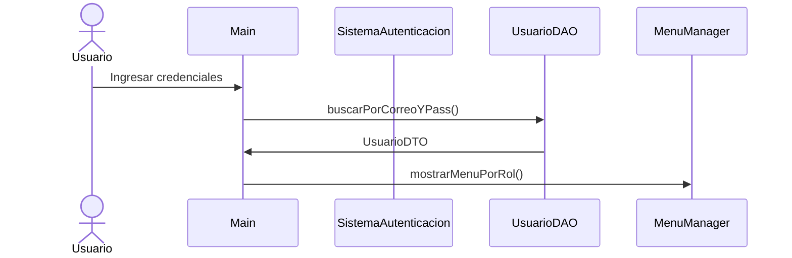
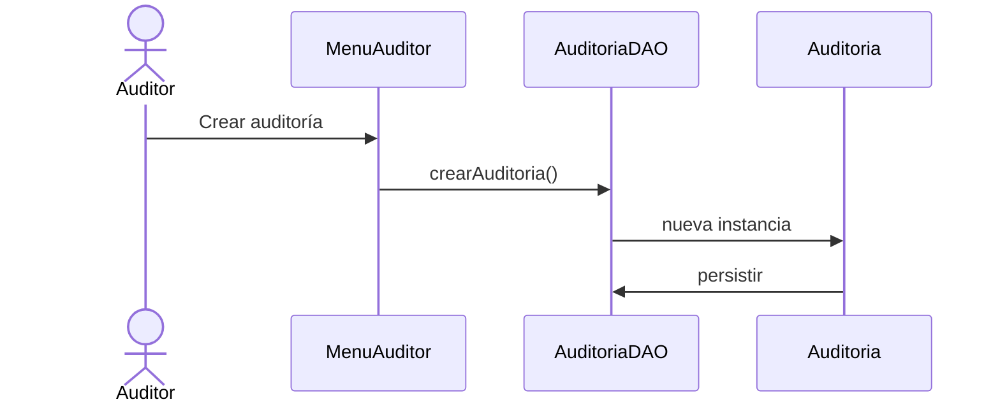

# Arquitectura del Sistema TrackVerAA

## 1. Visión General

TrackVerAA es una aplicación de consola Java diseñada para gestionar auditorías y reportes preliminares. El sistema implementa una arquitectura en capas con los siguientes componentes principales:

### 1.1 Capas de la Aplicación

1. **Capa de Presentación** (`com.trackver.ui`)
   - Interfaces de consola para diferentes roles de usuario
   - Gestión de menús y entrada/salida de datos

2. **Capa de Lógica de Negocio** (`com.trackver.model`, `com.trackver.auth`)
   - Entidades del dominio
   - Lógica de autenticación y autorización
   - Reglas de negocio para auditorías y reportes

3. **Capa de Acceso a Datos** (`com.trackver.db`)
   - DAOs para interacción con la base de datos
   - Gestión de conexiones SQLite
   - Mapeo de datos entre la BD y objetos Java

## 2. Componentes Principales

### 2.1 Gestión de Usuarios
- **Clases principales**: `UsuarioDAO`, `SistemaAutenticacion`
- **Responsabilidades**:
  - Autenticación de usuarios
  - Gestión de roles y permisos
  - CRUD de usuarios

### 2.2 Sistema de Auditorías
- **Clases principales**: `AuditoriaDAO`, `Auditoria`, `ReportePreliminar`
- **Responsabilidades**:
  - Creación y gestión de auditorías
  - Generación de reportes preliminares
  - Seguimiento de estados de auditoría

### 2.3 Tracking de Posiciones
- **Clases principales**: `PosicionDAO`
- **Responsabilidades**:
  - Registro de posiciones GPS
  - Consulta de histórico de posiciones
  - Asociación con usuarios

## 3. Flujos Principales

### 3.1 Flujo de Autenticación


### 3.2 Flujo de Auditoría


## 4. Base de Datos

El sistema utiliza tres bases de datos SQLite independientes:

### 4.1 usuarios.db
```sql
CREATE TABLE usuarios (
    id INTEGER PRIMARY KEY AUTOINCREMENT,
    nombre TEXT NOT NULL,
    correo TEXT UNIQUE NOT NULL,
    contrasena TEXT NOT NULL,
    nivelAcceso INTEGER NOT NULL
);
```

### 4.2 auditorias.db
```sql
CREATE TABLE auditorias (
    id INTEGER PRIMARY KEY AUTOINCREMENT,
    titulo TEXT NOT NULL,
    descripcion TEXT,
    fecha TEXT NOT NULL,
    estado TEXT NOT NULL,
    usuario_id INTEGER
);
```

### 4.3 posiciones.db
```sql
CREATE TABLE posiciones (
    id INTEGER PRIMARY KEY AUTOINCREMENT,
    latitud REAL NOT NULL,
    longitud REAL NOT NULL,
    fechaHora TEXT NOT NULL,
    usuario_id INTEGER
);
```

## 5. Consideraciones Técnicas

### 5.1 Seguridad
- Autenticación basada en correo y contraseña
- Sistema de roles con tres niveles: Usuario, Auditor, Admin
- Validación de permisos por menú y operación

### 5.2 Persistencia
- Uso de SQLite para almacenamiento local
- Conexiones gestionadas con try-with-resources
- DAOs implementan patrones DTO para transferencia de datos

### 5.3 Mantenibilidad
- Separación clara de responsabilidades por paquetes
- Uso de interfaces de usuario modulares
- Código documentado y estructurado